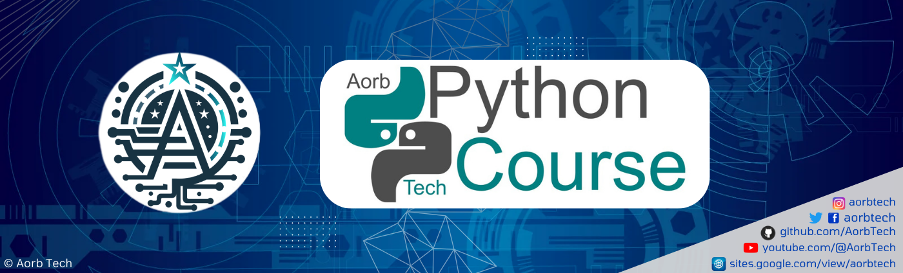

## 01. Introduction to Python
1.1 What is Python?  
1.2 Feature of Python  
1.3 How to Install Python  

## 02. Basics of Python 
2.1 Writing Your First Program Using `print`  
2.2 How to Install Packages Using `pip`  
2.3 How to Use Modules in Python  
2.4 How to Write Comments in Python  

## 03. Variables, Datatype, Operations
3.1 How a Define a  Variables  
3.2 Datatypes like `int`, `float`, `str`, `bool`  
3.3 Operations like `Arithematic`, `Assginemnt`, `Comparison`, `Logical`  
3.4 Typecasting  
3.5 Input Funcation  

## 04. Strings
4.1 Syntax  
4.2 Concatenation  
4.3 Slicing  
4.4 Functions  
4.5 Special characters  
4.6 Raw strings  
4.7 String interpolation  

## 05. Lists and Tuples
5.1 Create list  
5.2 List Indexing  
5.3 List Slicing  
5.4 Change Item in List  
5.5 List Methods  
5.6 Create Tuple  
5.2 Tuple Indexing  
5.3 Tuple Slicing  
5.5 Tuple Methods  

## 06. Dictionaries and Sets
6.1 Creating Dictionaries  
6.2 Accessing Dictionaries  
6.3 Dictionary Methods  
6.4 Creating Sets  
6.5 Set Methods  
